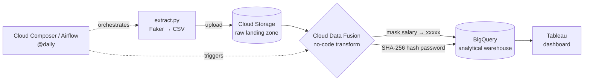

<p align="center">
  
</p>

# GCP Secure Employee Data Pipeline

**A reference data-engineering pipeline on Google Cloud that demonstrates PII protection.** It generates synthetic employee records, masks salaries and hashes passwords *before* they reach the warehouse, lands the protected result in BigQuery, and serves it through Tableau — orchestrated end-to-end by Airflow on a daily schedule.


---

## Architecture



**Flow:** Airflow runs `extract.py` to generate synthetic employee records and upload them to GCS → Airflow triggers the Cloud Data Fusion pipeline, which masks salaries and SHA-256-hashes passwords → the protected data lands in BigQuery → Tableau reads BigQuery for reporting. The DAG sequences `extract → transform` so the transform never runs on stale data.

## What it demonstrates

- **A PII-protection pattern** — salary masking (`xxxxx`) + one-way password hashing, applied *before* data is warehoused
- **Orchestration** — a daily Airflow schedule on Cloud Composer with task dependencies, retries, and failure alerts
- **GCP-native stack** — GCS, Cloud Data Fusion, BigQuery, Cloud Composer, Tableau
- **Reviewable security logic** — the no-code Data Fusion transform is reproduced as testable Python (`secure_transform.py`) with unit tests
- **Configurable, not hard-coded** — record count, GCP region, Data Fusion instance/pipeline, and an optional HMAC pepper are all environment-driven

## The PII protection, made explicit

The masking + hashing runs no-code inside Cloud Data Fusion in production.
[`transforms/secure_transform.py`](transforms/secure_transform.py) reproduces that exact
logic in plain Python so it's reviewable and testable. The repo ships a before/after
sample, generated from a **fixed seed** so the values below are reproducible:

| Field | Raw (`employee_data.csv`) | Protected (`employee_data_secure.csv`) |
|-------|---------------------------|----------------------------------------|
| `salary` | `46556` | `xxxxx` |
| `password` | `JFCrn](l.2ed` | `23b8e6eb…87ee7` (SHA-256) |

```bash
python transforms/secure_transform.py employee_data.csv employee_data_secure.csv
python tests/test_secure_transform.py        # unit tests for the transform
```

## Security notes & honest limitations

This is a **portfolio/reference pipeline on synthetic data**, not a hardened production system — and it's worth being explicit about what that means (a reviewer will ask):

- **Password hashing.** The demo defaults to unsalted SHA-256, which is fast and reversible for weak passwords via rainbow tables. Set a `PII_PEPPER` env var to switch to **HMAC-SHA256** (not reversible without the key). Real credential storage should use a salted, slow KDF — bcrypt / scrypt / Argon2.
- **Source-stage exposure.** The raw extract writes plaintext PII to disk and to the GCS landing bucket *before* masking. In production that bucket needs restricted IAM, encryption, and lifecycle deletion.
- **Scope.** Only salary and password are transformed; names / email / phone / address pass through (they're synthetic). A real PII program would tokenize those too.
- **Scale.** The architecture (Data Fusion + Dataproc) scales horizontally, but this has only been run at 100 synthetic records — it has not been load-tested at 100K+.

## Tech stack

Python + Faker · Google Cloud Storage · Cloud Data Fusion · BigQuery · Cloud Composer (Airflow) · Tableau

## Project structure

```
dags/employee_secure_daily_pipeline.py   → Airflow DAG (orchestration)
dags/scripts/extract.py                  → synthetic data generation (+ optional GCS upload)
transforms/secure_transform.py           → reference impl of the masking + hashing
tests/test_secure_transform.py           → unit tests for the transform
employee_data.csv                        → sample raw output (before protection)
employee_data_secure.csv                 → sample protected output (after)
requirements.txt                         → local data-generation deps
```

## Run locally (no GCP needed)

```bash
pip install -r requirements.txt
python dags/scripts/extract.py        # writes employee_data.csv (uploads only if GCS_BUCKET is set)
python transforms/secure_transform.py employee_data.csv employee_data_secure.csv
```

Optional knobs (all read from the environment):

```bash
export NUM_EMPLOYEES=1000      # change the record count
export PII_PEPPER=some-secret  # switch password hashing to HMAC-SHA256
export GCS_BUCKET=your-bucket  # also upload the raw extract to Cloud Storage
```

## Run the full GCP pipeline

1. Provision GCS, a Cloud Data Fusion instance, and a BigQuery dataset in your project.
2. Build the Data Fusion pipeline with the salary-mask + SHA-256 transforms.
3. Deploy `dags/` (including `dags/scripts/`) to your Cloud Composer bucket, and add **`faker`** (and confirm `google-cloud-storage`) to the environment's PyPI packages.
4. Set the env vars / Airflow Variables: `ALERT_EMAIL`, `GCP_REGION`, `DATAFUSION_INSTANCE`, `DATAFUSION_PIPELINE`, `GCS_BUCKET`.
5. Enable the `employee_secure_daily_pipeline` DAG — it runs daily and publishes to BigQuery for Tableau.

## License

MIT
