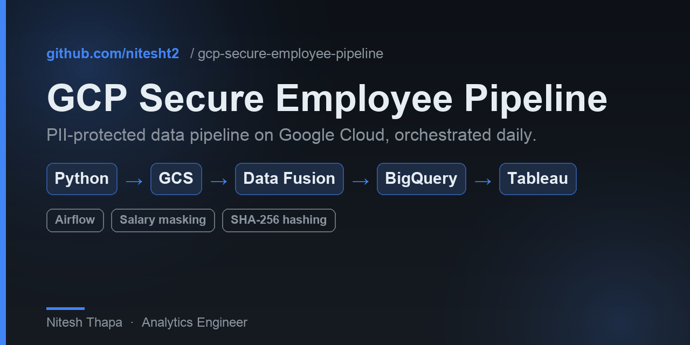
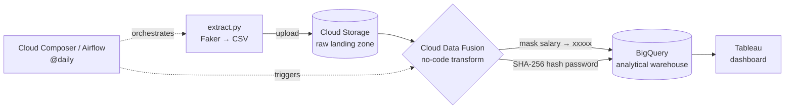

<p align="center">
  
</p>

# GCP Secure Employee Data Pipeline

**A production-grade, PII-protected data pipeline on Google Cloud.** It generates sensitive employee records, applies compliance-grade protection (salary masking + SHA-256 password hashing) in Cloud Data Fusion, lands the result in BigQuery, and serves it through Tableau — orchestrated end-to-end by Airflow on a daily schedule.


---

## Architecture



**Flow:** Airflow runs `extract.py` to generate 100 synthetic employee records and upload them to GCS → Airflow triggers the Cloud Data Fusion pipeline, which masks salaries and SHA-256-hashes passwords → clean, protected data lands in BigQuery → Tableau reads BigQuery for interactive reporting. The DAG enforces task dependencies (`extract → transform`) so the transform never runs on stale data.

## Key features

- **PII protection by design** — salaries masked (`xxxxx`), passwords cryptographically hashed (SHA-256); raw sensitive values never reach the warehouse
- **Daily automation** — `@daily` Airflow schedule on Cloud Composer, no manual steps
- **Dependency-managed orchestration** — `extract_data >> start_datafusion_pipeline`
- **100% GCP-native** — GCS, Cloud Data Fusion, BigQuery, Cloud Composer, Tableau
- **Scales without code changes** — validated at 100 records, ready for 100K+

## Business impact

| Metric | Result |
|--------|--------|
| Manual data handling | Eliminated (100% automated) |
| PII exposure | Zero — salary + passwords protected before warehousing |
| Cost per daily run | ~$0.50 (Cloud Data Fusion) |
| Scalability | 100 → 100K+ records, no code changes |

## Tech stack

Python + Faker · Google Cloud Storage · Cloud Data Fusion · BigQuery · Cloud Composer (Airflow) · Tableau

## Project structure

```
dags/employee_secure_daily_pipeline.py   → Airflow DAG (orchestration)
dags/scripts/extract.py                  → synthetic data generation + GCS upload
employee_data.csv                        → sample generated output
```

## How to run

1. Provision GCS, a Cloud Data Fusion instance, and a BigQuery dataset in your GCP project.
2. Build the Data Fusion pipeline (`ETL Data Pipeline`) with the salary-mask and SHA-256 transforms.
3. Drop `dags/` into your Cloud Composer environment's bucket.
4. Update the bucket name and pipeline/instance names in the DAG and `extract.py` to match your project.
5. Enable the `employee_data` DAG — it runs daily and publishes to BigQuery for Tableau.

## License

MIT
